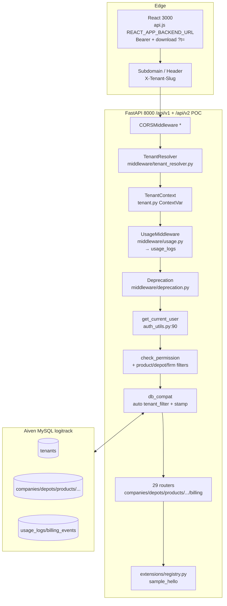
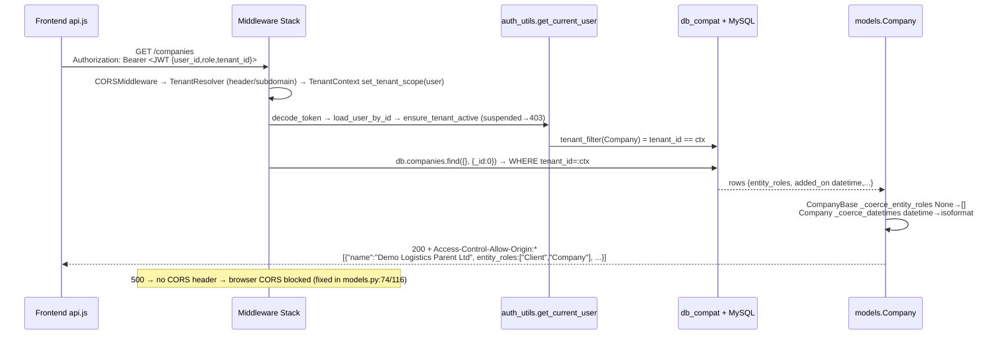

# LogiTrack SaaS Flow Map — Present State (Phases 0–6)

> Source: `phase2/phase-2-plan.md` + `backend/` + `frontend/` + `backend/scripts/seed_demo.py`
> Stack: FastAPI `backend/server.py:1883`, SQLAlchemy async `backend/database.py`, Aiven MySQL, React 18 `frontend/src/lib/api.js:5`, `db_compat` Mongo-compat `backend/routes/db_compat.py`.

## 1. High-Level Architecture



## 2. Request Lifecycle — One `GET /api/v1/companies`



**Files**: `backend/tenant.py:15 set_tenant_scope/tenant_filter`, `backend/middleware/tenant_resolver.py`, `backend/middleware/usage.py`, `backend/routes/db_compat.py:1 _queryFilter`, `backend/auth_utils.py:90,174,237,267,345`, `backend/models.py:74,116`, `backend/config.py:PERMISSION_DEFAULTS`.

## 3. Tenant Model — Multi-Tenancy Core (Phase 0)

`migrations/04_tenancy.sql` → `tenants` table:
```sql
id VARCHAR(36) PK (= uuid5 logiTrack.{slug})
slug UNIQUE (demo, acme, platform)
name, status active|suspended, subscription_plan free|pro|enterprise
branding JSON {name, primary, accent}, feature_flags JSON {invoices,stock_transfers,leads,firms}
```
* All biz tables `+ tenant_id VARCHAR(36) NOT NULL` + `INDEX idx_tenant`; uniques re-scoped `uk_mobile → (tenant_id,mobile)`, `uk_product_code → (tenant_id,product_code)`, `uk_vehicle_number → (tenant_id,vehicle_number)` etc.
* `PLATFORM_TENANT_ID=11111111-1111-1111-1111-111111111111` master admin `is_master_admin=true` bypass.
* `uploads/{tenant_id}/{file_id}` isolation + legacy fallback `backend/server.py`.

**Tenant lifecycle**:
`POST /api/v1/tenants` (master) → `GET /api/v1/tenants` → `GET /api/v1/tenant/config` (public) → `ThemeProvider` applies branding/primary/accent → `Sidebar.jsx` feature-flagged nav. Seeder `backend/scripts/seed_demo.py:40 DEMO_TENANTS` `demo:48128eb0` `acme:5c26ca7b`.

## 4. Auth & Scope

```mermaid
flowchart LR
  Login[POST /auth/login<br/>{mobile,country_code,password,tenant}] --> Lookup[_find_user_by_mobile<br/>mobile normalized + tenant.slug]
  Lookup --> JWT[create_token<br/>{user_id,role,tenant_id,exp 7d}]
  JWT --> Store[localStorage token + user]
  Store --> Req[api.js interceptor<br/>Authorization: Bearer]
  Req --> Decode[decode_token → load_user_by_id]
  Decode --> Scope[set_tenant_scope user<br/>ContextVar]
  Scope --> Guard[check_permission Management→true<br/>fetch_permissions merged defaults]
  Guard --> Prod[get_user_product_ids<br/>assigned ∪ role - excluded ∩ firm_grant]
  Guard --> Depot[get_user_depot_ids]
  Prod --> Filter[build_product_filter → {product_id:{$in:[]}} or {}]
```

**Key**: `auth_utils.py:237` Management now unrestricted (`None`), `get_excluded_source_ids:345` returns `None` for Management, `get_user_firm_granted_pairs:400` unrestricted. Download `?t=` `create_download_token:113` 30m scoped `get_download_user:125` for exports/PDFs (`withDownloadToken` `api.js:84`).

## 5. Phase Flows — Data

### P1 Source & Product
`companies`: `Source|Client|Company` `entity_roles` + `parent_client_id` self-check → `depots.company_id` `05_...` → `products` `assigned_roles` → `source_products` (Depot/Company×Product) 4 rows. Resolver `get_excluded_source_ids` + `build_source_exclusion_filter_async` hides mapped source when user's product set lacks mapped product (`"2 products 1 permission"` `Weightment p1 vs d1 p1,p2`). Frontend: `sourcesApi.getAll(type)` dropdowns, `ProductAccess` tab overrides `product_overrides` + `company_pricing`.

**Files**: `migrations/05_depot_ownership.sql 06_source_products.sql 07_po_source.sql 08_product_overrides.sql`, `routes/sources.py routes/source_access.py`.

### P2 Locations & Clients
`regions → locations → depots` (`09_`), `companies` `client_type Client/vendor`, `client_offices/factories`, `client_modules`, `leads` (`Sales|Purchase` `New→Converted` → creates client) + `firms` `firm_access` `product×depot` grant (`"5×3→1×2"`). `locations/tree` + `overview` rollup.

### P3 Employees & Grants
`departments/designations/employees` `14_employees.sql` `users.employee_id`, `employees.leads_scope All|Sales|Purchase`, `POST /employees/{id}/enable-login` creates `User` `password_set=false`. Firm grant wired app-wide: `effective_products &= granted` strict global intersection. `UserManagement` picker.

### P4 Invoicing
`PO (source_id/name)` `03...` → `Invoice.generate?po_id` `pick_company_rate` (`company_pricing` per_tonne) `Invoice + InvoiceItem` `Draft→Issued→Paid`, `payment + invoice_payment + credit_note/debit_note`, `GET .../export pdf|excel` + reconciliation.

**Files**: `15_invoices 16_payments 17_notes`, `routes/invoices.py routes/payments.py routes/notes.py`.

### P5 Stock Transfers
`18_stock_transfers 19_approval_matrices 20_inventory_locks (locked_qty)` state `Requested→Approved→Dispatched→Received` `POST /stock-transfers/{id}/approve|dispatch|receive`, `ApprovalMatrix` resolver, `_lock_source/_move_inventory` `depot_inventory/company_inventory` `GET /stock-transfers/export` ledger.

### P6 Usage/Billing/Versioning
`21_usage_logs 22_subscriptions` `Subscription BillingEvent`, `middleware/usage.py` all `30d`, `GET /usage/summary|logs|quota-check`, `POST /billing/webhook/{stripe|paypal}` stubs `billing/providers.py`, `/api/v2` POC `middleware/deprecation.py`, `extensions/sample_hello`.

## 6. Frontend Flow

`api.js:11 axios baseURL /api/v1` → `permissions.jsx:ROUTE_TO_PERMISSION` → `Sidebar` + `usePermissions hasPermission` guards pages. `InventoryWallet.jsx:39` is canonical parallel load:
```js
Promise.all([depotInventoryApi.getAll(), depotsApi.getAll(), productsApi.getAll(),
  liftingsApi.getAll({page_size:500}), pickupApi.getAll({status:'verified...'}), 
  companiesApi.getAll(), companyInventoryApi.getAll()])
```
Grouped `by depot_id/company_id` + ledger `GET .../ledger/{id}/{product}?date_from=&date_to=`.

## 7. Demo / Seed Flow

```mermaid
flowchart LR
  Seed[python scripts/seed_demo.py --fresh] --> Wipe[wipe_tenant demo+acme<br/>TENANT_TABLES children→parents]
  Wipe --> Tenant[ensure_tenant demo/acme<br/>branding/feature_flags]
  Tenant --> Regions[2 regions 3 locations]
  Regions --> Companies[4 companies source/parent/2 children]
  Companies --> Depots[3 depots MGMT/Admin/Weightment]
  Depots --> Products[3 products Cement/Steel/Aggregate<br/>assigned_roles MGMT/Admin]
  Products --> Rest[offices/factories/depts/transporters/trucks/5<br/>8 users 919000000001-008 Demo@123<br/>6 employees + link<br/>5 leads 2 firms + 2 firm_access<br/>3 DO 3 PO 4 inventory 6 liftings 8 pickups 3 invoices 2 payments 2 matrices 4 transfers]
  Rest --> Login[POST /auth/login tenant=demo<br/>919000000001 Management→ 3/3/3]
```



**Credentials**: `demo/acme` `Management919000000001 … Dispatch Verifier 008` all `Demo@123` `country_code 91`.

## 8. Failure Modes Fixed (2026-08)

* `Company entity_roles None` + `added_on datetime` → `models.py _coerce_entity_roles/_coerce_datetimes` (was `500` → CORS blocked)
* `Pickup weight_slips None` → `_coerce_pickup_lists` (was `pickups?status=... 500`)
* `Management` product/depot `[]→None` unrestricted `auth_utils.py:237,267`

## 9. Where to Look

| Concern | File |
|---------|------|
| Tenancy | `backend/tenant.py`, `migrations/04_tenancy.sql`, `routes/tenants.py`, `frontend/src/lib/ThemeProvider.jsx` |
| Auth/Scope | `backend/auth_utils.py`, `backend/routes/db_compat.py` |
| Source | `routes/sources.py`, `models.SourceProduct` |
| Locations | `routes/regions.py`, `routes/locations.py` |
| Employees | `routes/employees.py`, `config.leads_scope` |
| Invoices | `routes/invoices.py`, `services/pricing.py` |
| Transfers | `routes/stock_transfers.py` |
| Billing | `routes/billing.py`, `middleware/usage.py`, `models_sqlalchemy.Subscription` |

> Render this file with any Mermaid renderer (VS Code, GitHub, `npx mermaid-cli -i docs/SAAS_FLOW.md -o docs/SAAS_FLOW.png`).
